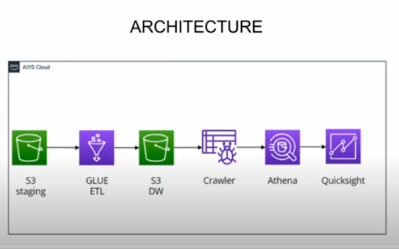

# Spotify Music Data ETL Project 🎵

## 📋 Project Overview
This project demonstrates an **ETL pipeline** and **data visualization** using AWS services, with the goal of analyzing Spotify music data. It extracts, transforms, and loads data into AWS services like **S3** & **Aws Glue**  and **Athena**. The visualizations are created in **QuickSight** to provide insights into albums, artists, and track popularity.

---

## 🚀 Architecture Overview
Here is a high-level view of the project architecture:

1. **Data Source**: Spotify datasets (albums, artists, tracks).  
2. **Storage**: AWS S3 for storing raw and transformed data.  
3. **Query Engine**: Athena for running SQL queries on the datasets.  
4. **Visualization**: QuickSight to display music insights in dashboards.

_

## 🛠️ Technologies and Services Used
- **AWS S3** – Cloud storage for datasets
- **AWS Athena** – Query engine for structured data
- **AWS Glue** - Automated ETL pipeline for data processing  
- **AWS QuickSight** – Dashboard and visualization tool
- **Python** – For ETL scripts and data transformation
- **GitHub** – Version control and project repository

---

## 📂 Project Structure
```bash
spotify-etl-project/
├── code/                  # ETL Scripts, Lambda Functions, SQL Queries
│   ├── etl_pipeline.py
│   └── athena_queries.sql
├── data/                  # Raw or transformed data (optional)
├── screenshots/           # Visuals from QuickSight
│   └── dashboard.png
├── architecture/          # Architecture diagram (optional)
│   └── architecture.png
├── config/                # Configuration files (without sensitive info)
├── .gitignore             # Excludes sensitive files from GitHub
└── README.md              # Project Documentation (this file)
